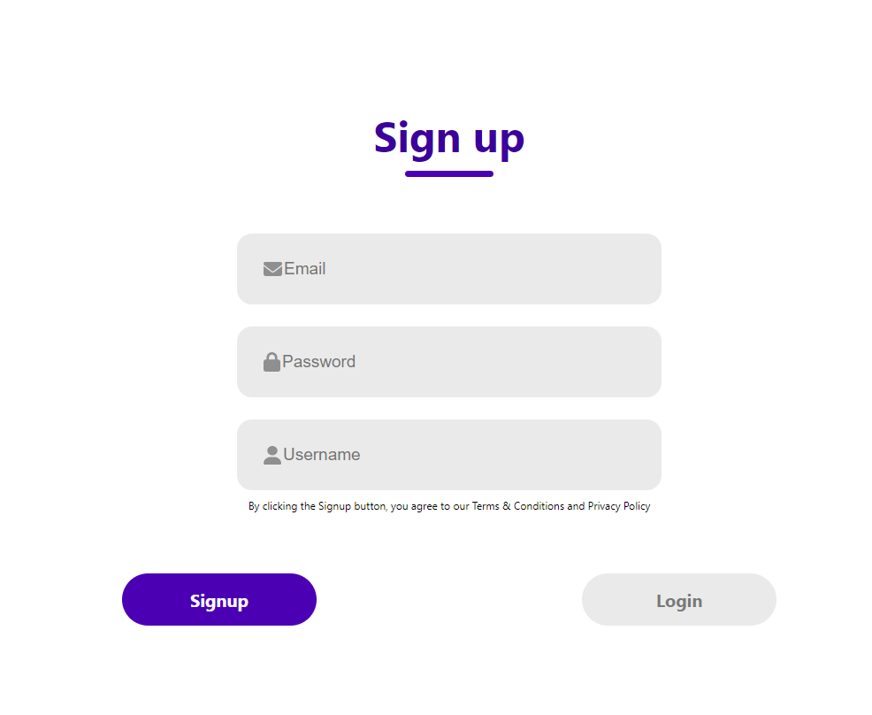

# Login/Sign Up Page

This is a simple login/sign up page built using ReactJS. It allows users to create an account, log in, and access their personalized dashboard.

## Features

- User registration: Users can create a new account by providing their email address and password.
- User login: Existing users can log in using their registered email address and password.
- Password recovery: Users can reset their password in case they forget it.
- Dashboard: Once logged in, users are redirected to their personalized dashboard where they can manage their account settings.

## Screenshot

## Installation

1. Clone the repository: `git clone https://github.com/Amit00008/LoginSignup-using-Reactjs`
2. Navigate to the project directory: `cd your-repo`
3. Install dependencies: `npm install`
4. Start the development server: `npm start`

## Usage

1. Open your web browser and navigate to `http://localhost:3000`.
2. You will be redirected to the login/sign up page.

## Contributing

Contributions are welcome! If you find any bugs or have suggestions for improvement, please open an issue or submit a pull request.

## License

This project is licensed under the [MIT License](LICENSE).
